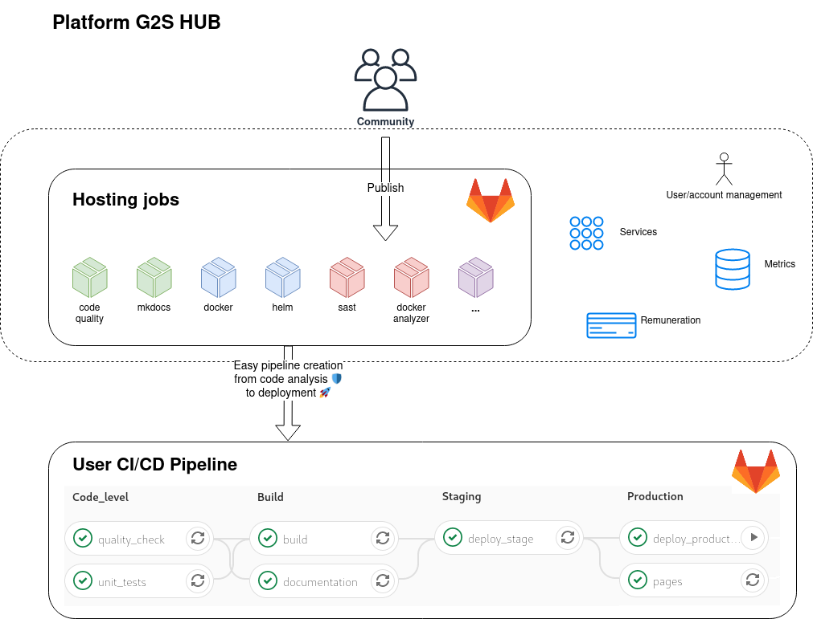

# Concept

The **Go2Scale HUB** is a collaborative hub of CI & CD
**ready to use** jobs which helps you to easily build powerful pipelines for your
projects.

!!! info
    Currently, the hub is focused to provides only **Gitlab 🦊** jobs. We plan
    to support more CI/CD platforms in the future.

Each jobs of the hub can be used independently to create fully **customized pipelines.**
You can use them for any kind of software and deployment type. Each job can be
customized through configuration.

* 🚀 Start using jobs from the hub: [Use the HUB](/use-the-hub)
<!-- * 🙋 Contribute to the hub: [Contributing](/contributing) -->

## Overview

