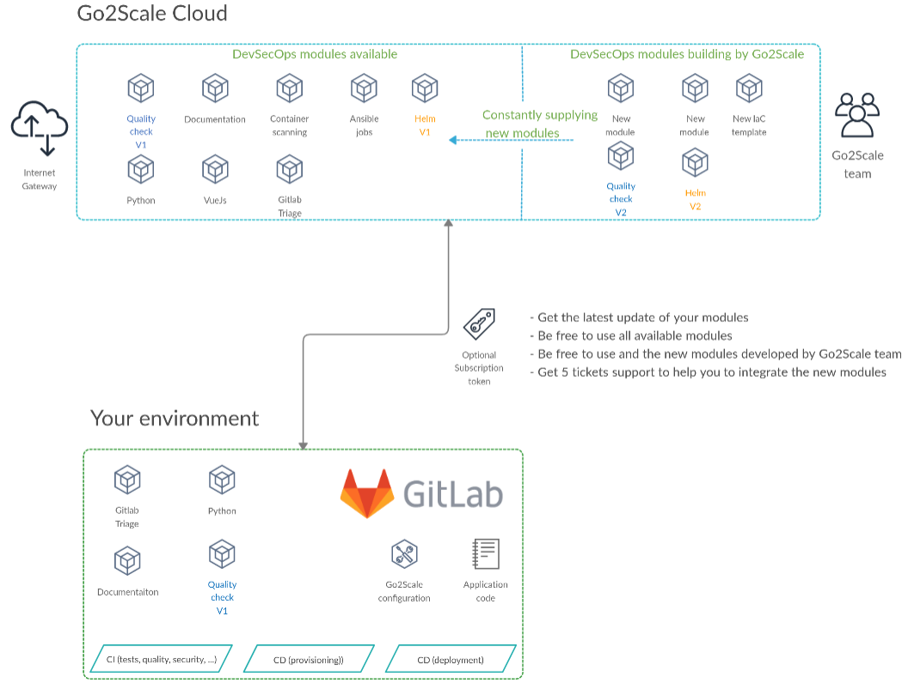

# Concept

## Overview

## Description

We offer 2 levels of modules:

**Pipeline** templates: multiple jobs assembled in a workflow

* Easy to use, just import the template in your CI configuration
* Must be consitent with your software and deployment type
* Customizable through configuration

**Jobs** templates: only one jobs

* Can be used unitary or to create fully customs pipelines
* Adaptable to any kind of software and deployment type
* Customizable through configuration
