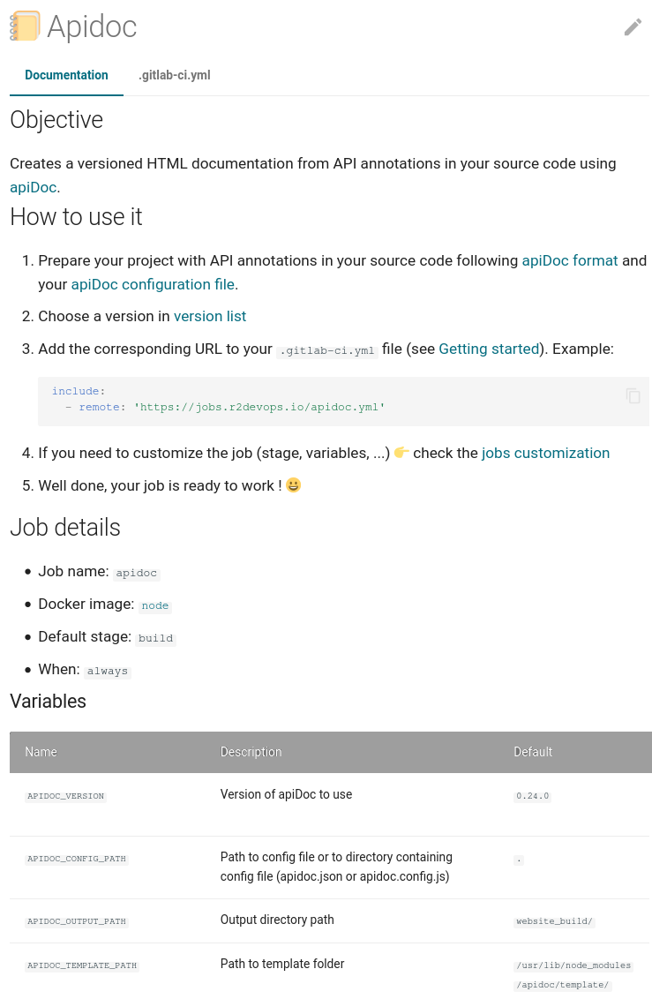

# Structure of a job

Jobs are stored in the [R2Devops hub](https://gitlab.com/r2devops/hub)
repository inside the
[`jobs`](https://gitlab.com/r2devops/hub/-/tree/latest/jobs) folder, and
follow this standardized structure:

```
.
└── jobs
    └── <job_name>
        ├── <job_name>.yml        # Job definition
        ├── job.yml               # Job metadata
        ├── README.md             # Job documentation
        ├── versions              # Jobs changelogs
        │   ├── 0.1.0.md
        │   └── ...
        └── screenshots           # Job screenshots
            ├── job_picture.png
            └── ...
```

*A template of job is available in the [R2Devops hub repository](https://gitlab.com/r2devops/hub/-/tree/latest/tools/job_template/job_name).*

## 🤖 Job definition

This file must have the same name as the job with the `yml` extension:
`<job_name>.yml`. It contains the Gitlab job configuration in `yaml` format.

!!! info
    * The jobs of the hub use the Gitlab CI/CD configuration format.
    * The jobs of the hub must specify a Docker image to be run in a container.
    * See [GitLab CI/CD pipeline configuration
      reference](https://docs.gitlab.com/ee/ci/yaml/){:target=blank}.
    * See [R2Devops guidelines and best
      practices](/create-update-job/#guidelines) about
      job definition.

Job definition usually contains the following fields:

* **[`image`](https://docs.gitlab.com/ee/ci/yaml/#image){:target="_blank"}**: this is the docker image used to run the job.
* **`stage`** (mandatory): this is the default stage for the job, it must come from our [default stage list](/use-the-hub/#stages).
* **[`script`](https://docs.gitlab.com/ee/ci/yaml/#script){:target="_blank"}** (mandatory): this is the heart of the job. It contains a list of shell commands to run the job.
* **[`variables`](https://docs.gitlab.com/ee/ci/yaml/#variables){:target="_blank"}**: in this field, you will find all the variables used by the `script` part of the job to customize its behavior.
* **[`artifacts`](https://docs.gitlab.com/ee/ci/yaml/#artifacts){:target="_blank"}**: it specifies the result of the job that should be exposed to the user through classic artifact or Gitlab reports.

**Here is an example of job definition [`apidoc.yml`](https://r2devops.io/jobs/build/apidoc/) 👇**

```yaml
apidoc:
  image:
    name: node:12.18.3-alpine3.12
    entrypoint: [""]
  stage: build
  variables:
    APIDOC_CONFIG_PATH: '.'
    APIDOC_OUTPUT_PATH: 'website_build/'
    APIDOC_TEMPLATE_PATH: '/usr/local/lib/node_modules/apidoc/template/'
    APIDOC_VERSION: '0.24.0'
  script:
    - npm install apidoc@$APIDOC_VERSION -g
    - apidoc -c "$APIDOC_CONFIG_PATH" -o "$APIDOC_OUTPUT_PATH" -t "$APIDOC_TEMPLATE_PATH"
  artifacts:
    when: always
    expose_as: "apiDoc build"
    paths:
      - "$APIDOC_OUTPUT_PATH"
```


## 🗂 Job metadata

This file, named `job.yml`, contains the job metadata in `yaml` format with
the following fields:

| Name | Description | Mandatory |
| ---- | ----------- | --------- |
| `name`  | Name of the job, must be unique | **Yes** |
| `description` | Short description of the job | **Yes** |
| `icon` | Unicode emoji character to represent the job (if you lack inspiration, you can find some in [emojipedia](https://emojipedia.org)) | **Yes** |
| `default_stage` | Default stage of the job. You have to choose the most relevant stage from our [default stage list](/use-the-hub/#stages). We promise you will find the one you need!  | **Yes** |
| `maintainer` | Gitlab username of the maintainer (be proud of your work) | **Yes** |
| `license` | Open-source license for the job. You can choose between `Apache-2.0` and `MIT` | **Yes** |
| `labels` | List of labels describing the job | No |
| `images` | Dict of docker image(s) used by the job. Please entre the image name as key and the tag version as value | **Yes** |
| `tools` | Dict of tool(s) installed during the job. Please entre the name as key and the version as value  | No |

**Here is an example of `job.yml` 👇**

```yaml
name: super_linter
description: Simple combination of various linters, to help validate the quality of your source code
default_stage: static_tests
icon: 🔎
maintainer: thomasboni
license: MIT
labels:
    - GitLab
    - Linter
    - Quality
```


## 📚 Job documentation

This file, named `README.md`, contains the documentation of a job  in `markdown` format.

=== "Example of README.md"

    ```md
    ## Description

    Creates a versioned HTML documentation from API annotations in your source
    code using [apiDoc](https://www.apidocjs.com/).

    ## How to use it

    1. Prepare your project with API annotations in your source code following
       [apiDoc format](https://apidocjs.com/#examples) and your [apiDoc
       configuration file](https://apidocjs.com/#configuration).
    2. Choose a version in [version list](#changelog)
    3. Add the corresponding URL to your `.gitlab-ci.yml` file (see [Getting
       started](/use-the-hub/)). Example:
        ```yaml
        include:
        - remote: 'https://jobs.r2devops.io/apidoc.yml'
        ```
    4. If you need to customize the job (stage, variables, ...) 👉 check the
       [jobs customization](/use-the-hub/#jobs-customization)
    5. Well done, your job is ready to work ! 😀

    ## Variables

    | Name | Description | Default |
    | ---- | ----------- | ------- |
    | `APIDOC_VERSION` | Version of apiDoc to use | `0.24.0` |
    | `APIDOC_CONFIG_PATH` | Path to config file or to directory containing config file (apidoc.json or apidoc.config.js) | `.` |
    | `APIDOC_OUTPUT_PATH` | Output directory path | `/documentation_build` |
    | `APIDOC_TEMPLATE_PATH` | Path to template folder | `/usr/lib/node_modules/apidoc/template/` |
    ```

=== "Result"

    {: .documentation_result }


## 🏗 Job changelogs

Jobs keep their changelogs in one folder, named `versions`. This folder contains several
`markdown` files, each of them representing a version and containing a list of
changes provided by this version.

!!! info
    * The jobs version must follow the [semantic versioning](https://semver.org/)
    format (`MAJOR.MINOR.PATCH`)
    * The first version for a job must be `0.1.0`

**Here is an example of a `versions` folder for a job 👇**

```shell
.
└── versions
    ├── 0.1.0.md
    ├── 0.2.0.md
    └── 0.3.0.md
```

=== "📃 0.1.0.md"

    ```md
    * Initial version
    ```

=== "📃 0.2.0.md"

    ```md
    * Add variable `DOCKERFILE_PATH` which permits specifying custom path to Dockerfile
    ```

=== "📃 0.3.0.md"

    ```md
    * New variable `DOCKER_USE_CACHE` to be able to cache layers of build
    * New variable `DOCKER_CACHE_TTL` to define time to live of cache
    * New variable `DOCKER_VERBOSITY` to set the verbosity of the build
    * New variable `DOCKER_OPTIONS` to be able to add additional options
    ```


## 🖼️ Job screenshots

Jobs can include screenshots, or any pictures, to improve documentation and
provide an overview of what the job does.

You can add as many pictures as you want in this folder, but try to add only
relevant images. You just have to put the file inside the folder, and they will
be included in the documentation.

Supported format: `.png`, `.jpeg`, `.jpg`

!!! warning
    If you don't want to add any pictures, you have to add at least an empty
    file named `.gitkeep` to ensure the folder presence in git!
